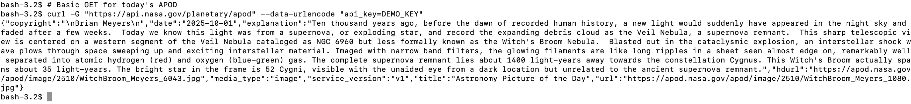

---
hide:
  - toc
---
Use cURL for command-line or scripted requests, ideal for quick automation without a GUI. 
# GET Request for Today’s APOD
```bash
curl -G "https://api.nasa.gov/planetary/apod" --data-urlencode "api_key=DEMO_KEY"
```
A successful command should earn a response like this: 


# GET Random APOD
```bash
curl -G "https://api.nasa.gov/planetary/apod" --data-urlencode "api_key=DEMO_KEY" --data-urlencode "count=5"
```
# GET Specific Date’s APOD
```bash
curl -G "https://api.nasa.gov/planetary/apod" --data-urlencode "api_key=DEMO_KEY" --data-urlencode "date=2025-10-01" --data-urlencode "hd=true"
```
