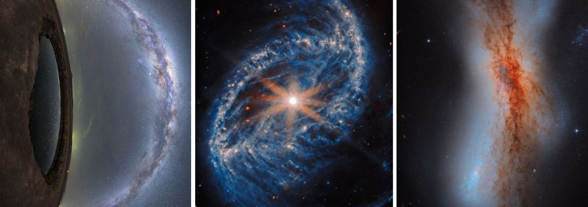

---
hide:
  - toc
---
This guide provides a concise overview of NASA's Astronomy Picture of the Day (APOD) API, enabling developers to quickly fetch and integrate daily space imagery into apps. It covers setup, a GET request test in Postman, response handling, advanced parameters, and code examples in Python and cURL. 

Photo Credits: NASA

### Prerequisites
You have Postman installed and understand basic API testing.
### Required
* NASA API key (sign up at [https://api.nasa.gov/](https://api.nasa.gov/) or use DEMO\_KEY for testing, limited to 30 requests/hour)  
* APOD endpoint: \`https://api.nasa.gov/planetary/apod\`  
* Rate limits: 1,000 requests/hour with personal key; respect to avoid 429 errors  
* Optional: Desktop Agent for Postman if making local requests
### Assumed Terms
* GET Request (data fetch)   
* Endpoint (server path)  
* Response (JSON output)  
* HTTP (API communication language)
