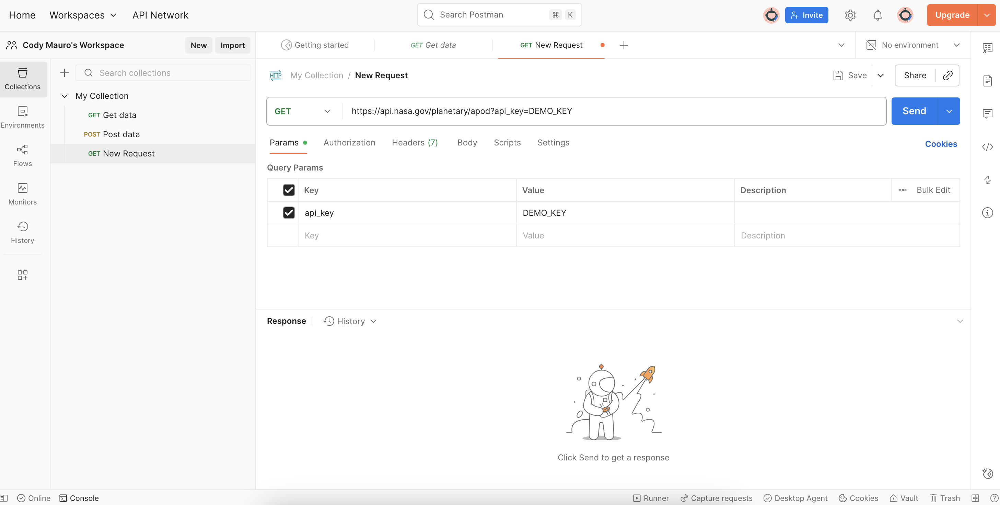
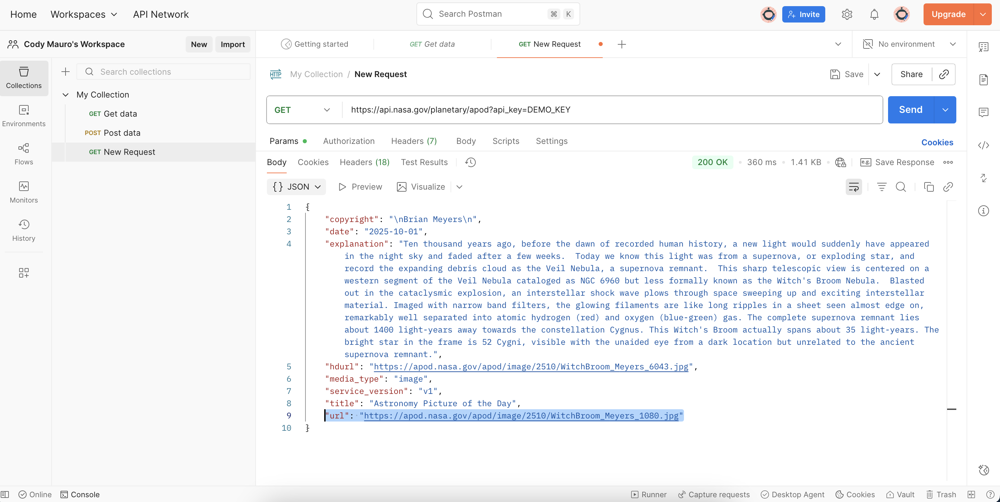

---
hide:
  - toc
---
With your NASA API key and endpoint, submit a GET request in Postman to test the endpoint before code integration.

1. Open Postman and create a **New Request**.  
2. Set the method to **GET**  
3. Enter your NASA-provided endpoint, ‘https://api.nasa.gov/planetary/apod’  
4. In Params, add key-value pair:  
     - Key: api_key  
     - Value: Your key or DEMO_KEY
5. Click Send; expect near-instant response if valid

### Response
With correct inputs, Postman responds with JSON data. Key-value pairs include *date*, *explanation*, *hdurl* (high-res if available), *media_type* (image or video), *title*,  and *url*.

The *url* value links to today's APOD media, seen below. (If media_type=image, the URL links to an image URL; if the APOD is video, url links to the video. Use thumbs=true param for a thumbnail_url static image on videos).
### Astronomy Photo of the Day
NGC 6960: The Witch's Broom Nebula  
October 1st, 2025  
Image Credit & Copyright: Brian Meyers

