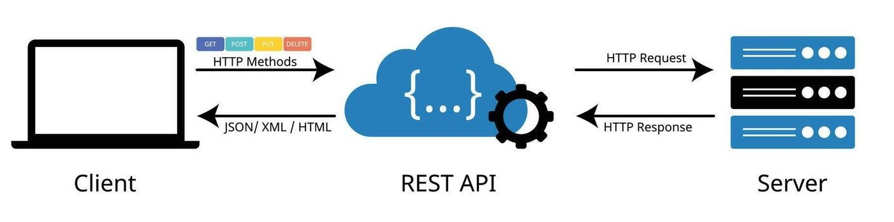

---
hide:
  - toc
---
This guide provides an overview of NASA's Astronomy Picture of the Day (APOD) Application Programming Interface. We explore this free-to-use **API** by following the processes developers use to fetch and integrate space imagery into their apps.

Users will learn: 

1. The basics of API.     
2. How to test APIs using Postman.    
3. And how to read, parse, and understand Postman’s response.
## What is an API?
An API sets the rules for software to talk to a digital **server** (a remote computer storing data). 

For instance, when you book a flight online, your computer doesn’t automatically just *know* which airlines have seats to your destination available. Your computer must request that information from the booker’s servers via an API. 

This is called a **GET request** — using an API to ask a server for specific information. 

Here’s a simpler analogy to help you visualize the concept without tech-heavy terms: Imagine you’re eating at a restaurant. The waiter takes your order, which he then brings to the kitchen; the cooks make the food, and, moments later, the waiter brings the meal to your table.

In this scenario, you made a GET request (your order) to the waiter (the API), who brought that request to the kitchen (the **endpoint**, or digital server) before returning with your meal (the **response**). You don’t need to know where the kitchen is or how the chef prepares your dish. You only need to tell the waiter what you want, and he handles the in-house details. 

To review:

> **GET request** = Your order. A request for data.    
> **API** = The waiter. Rules for software to talk to a server.      
> **Endpoint** = The kitchen. The digital space that contains the information you’re requesting.    
> **Response** = Your meal. An API’s output after communicating with the endpoint, and the answer to your GET request. 

NOTE: APIs can make several kinds of requests, like POST requests that *send* data instead of asking for it. For the sake of this demo, we’re looking only at GETs.  
