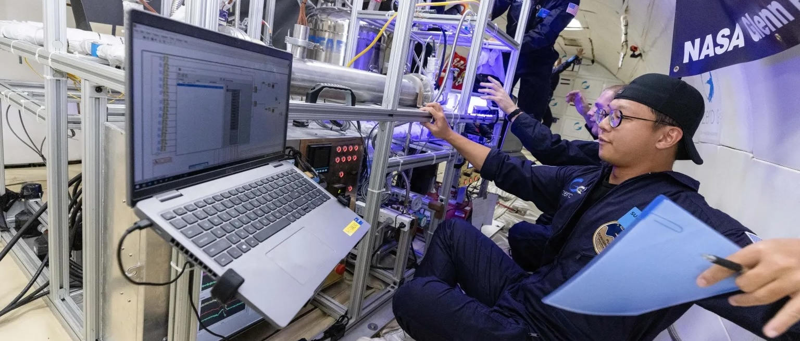
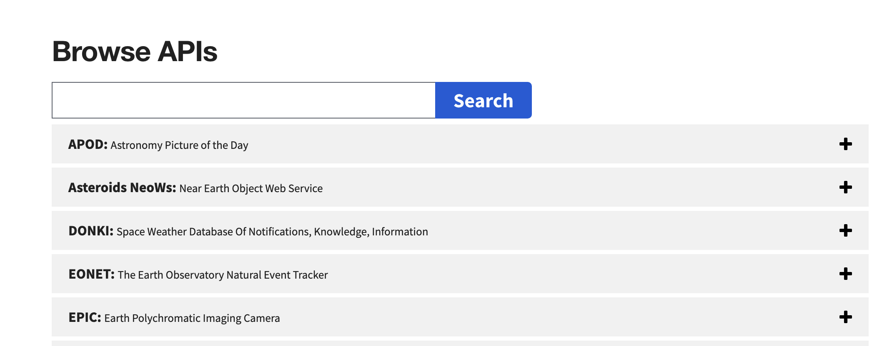

---
hide:
  - toc
---
NASA makes all its collected data accessible to developers or curious users like you. This lets developers build apps like a galaxy-mapping phone tool that uses NASA's satellite images.

    
Zero Gravity Corporation / Steve Boxall

In other words? NASA gives you the waiter to take that order to its fully-loaded kitchen (though NASA’s **rate limits** keep API key-holders to 1,000 requests per hour). You only need the password to gain access.  

> **Rate Limits** = How many **calls**, or requests, queries, etc., you can make with one API in an allotted time span. 

> **calls** = An interaction with the API. This includes single Get requests, as well as other API request types, like POST. 
### Getting Your NASA API Key
To begin, you need NASA to give you an **API Key**, or unique-to-you password that authenticates your access to the API. Think of this key like the hostess at a restaurant: you don’t get to see a menu, talk to a waiter, or place an order until you’ve been given a table.

Get your API key by:

1. Go to [https://api.nasa.gov/](https://api.nasa.gov/)    
2. Scroll down to “Generate API Key”    
3. Enter your name and email

4. Check your email for your unique API Key, a jumbled mess of random letters and numbers (e.g., ​​Tf9umjttkjh0cmoCPynT099aZStIjOoqvste0XEc).    
5. Copy your key in a safe place. *Do not share this key with anyone else, as it’s specific to you and your email. Allowing someone else to use your key could impact your ability to request servers in the future.*  

Additionally, if you’re only interested in exploring APIs at the moment and don’t want your own, personalized key, skip generating an API and, in the next steps, simply use the phrase **DEMO_KEY** in lieu of a unique key. Just know, the demo key limits you to 30 requests per hour.

> **API Key** = The Restaurant’s hostess. Unique passcode to access an API.    
> **DEMO_KEY** = A non-personalized key for testing purposes only. Limited calls per hour.
### Endpoints
NASA's API needs a roadmap to the specific portion of its vast data library (kitchen) you want to submit a Get request to. That’s where *endpoints* come in. Endpoints are URLs, or web addresses, that often use Hypertext Transfer Protocol, or **HTTP**, to send requests. Just like the standard way browsers fetch web pages.

Because NASA offers APIs and endpoints for more than just the APOD, you will need to select the correct URL from those listed beneath the key generation form on [https://api.nasa.gov/](https://api.nasa.gov/).  

Get the endpoint by:

1. Scroll down to the “APOD: Astronomy Picture of the Day” section.

  

2. Beneath the header HTTP Request, you will see the following endpoint: `[https://api.nasa.gov/planetary/apod](https://api.nasa.gov/planetary/apod).`    
3. Save that URL alongside your API key. 

> **HTTP** = Language. How APIs communicate with servers, or the words the waiter uses to talk to the chef. 
