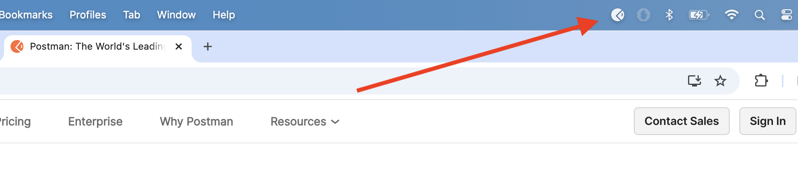

---
hide:
  - toc
---
You have an API, a key, and an endpoint. A developer would now test them to verify their functionality and avoid building an application around faulty inputs. They would use a platform like Postman to run these tests (as well as build and document APIs of their own).

Let’s do as the developers do and test to make sure the provided endpoints and API Key fulfill our GET request for the Astronomy Picture of the Day (APOD) with a response.
### How to Sign Up
1. Head to [postman.com](http://postman.com)    
2. Click “Sign Up for Free”    
3. Input an email, a username, and a password.     
4. Postman offers paid accounts. For the purposes of this tutorial, you do not need one.

Before we can test our NASA API, Postman requires one additional download.
### Download the Desktop Agent
Browsers limit local API requests, so Postman requires the **Desktop Agent** to bridge/connect from your browser to the full features of an API. You'll still work in your browser, as the Desktop Agent runs silent in the background.

To install the Desktop Agent, [click here and select your Operating System.](https://www.postman.com/downloads/postman-agent/)

For more instructions on installing the Desktop Agent, [review Postman’s official Installation Docs here](https://learning.postman.com/docs/getting-started/installation/installation-and-updates/#installing-the-postman-desktop-agent/).
