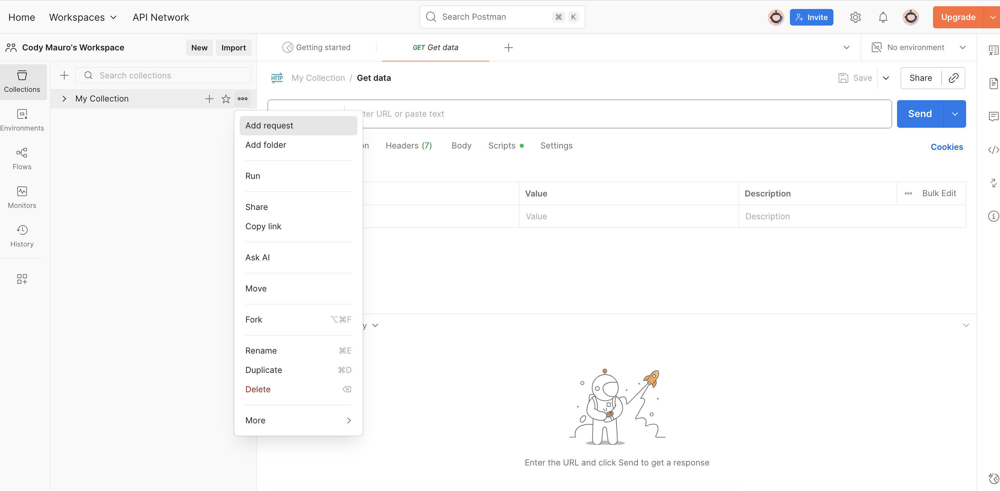
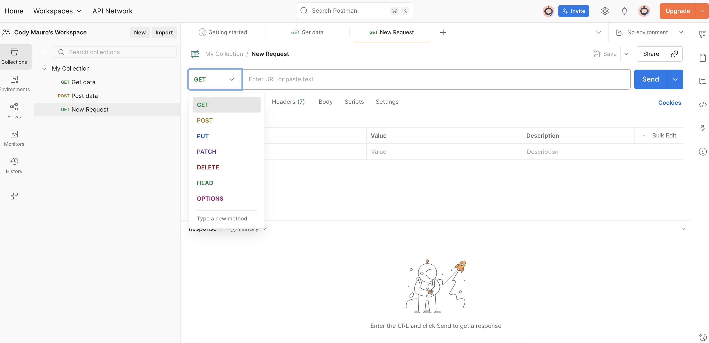

---
hide:
  - toc
---
Let’s make a GET request and tell NASA’s servers we want today's Astronomy Picture. NASA’s server will use the API to send back the data without us having to know how the server works. 

This is the core of APIs: they make complex server-level conversations simple for users like us. 

- Open Postman and click **Add Request** under the My Collection tab. This creates a blank slate where you can build your request from scratch.

- Set the **method** to **GET**(it's a dropdown menu next to the URL bar). Remember, GET requests fetch data without changing anything on the server. You only *get* info.

	> **Method** = Request type, like **GET** for retrieving or **POST** for sending.

- Paste your NASA-provided endpoint into the URL bar: https://api.nasa.gov/planetary/apod. This is the specific address for APOD data; without it, Postman wouldn't know where to send your order.

- In the **Params** tab (below the URL bar), where you can provide optional information to the server (like allergies to your waiter) add a **key-value pair**, (key = label, value = info):
    - Key: api_key
    - Value: Your unique API Key or DEMO_KEY here.

> **Params** = Food allergies/preferences. Additional information added to your **GET Request** that the digital server should know.      
> **key-value pair** = A way of organizing information. See step **Understanding the Response** for more details. 

- Click **Send** (the blue button next to the URL bar). Postman handles the communication. Now, we await the NASA server’s response. If all was done correctly, this should take less than a second. 

## Understanding the Response
Hit Send, and Postman's response pane (located beneath Params) displays your NASA data.

 Your meal has finally arrived in the readable data format known as JavaScript Object Notation, or **JSON** — a way of organizing key-value pairs into a list. Like the image below:

In this response, the keys, which are the left-aligned categorical phrases like *copyright*, *date*, or *url*, organize the values, or the “answers” to the keys. That means, for the key *copyright*, the value is Brian Meyers. For the key *url*, the value is [https://apod.nasa.gov/apod/image/2510/WitchBroom_Meyers_1080.jpg](https://apod.nasa.gov/apod/image/2510/WitchBroom_Meyers_1080.jpg).

And that URL? It leads to the Astronomy Picture of the Day. And that’s the prize. 

Congratulations! You just made a GET request (via NASA’s API) to the provided endpoint and received the day’s image in response.

### Astronomy Photo of the Day
NGC 6960: The Witch's Broom Nebula    
October 1st, 2025    
Image Credit & Copyright: Brian Meyers

## Why Test APIs?

Testing that NASA’s API simply works may seem trivial. But testing APIs — especially those not provided for free by a trusted government agency — makes or breaks app development. 

Imagine launching your galaxy-mapping phone tool. Users race to sign up, intrigued in particular by the ability to request random Astronomy Photos. However, when users hit the app button that says, “Give Me a Photo,” their request remains unfulfilled. They never get the photo!
Without first testing NASA’s API, developers risk this very scenario: launching an app that can’t communicate with distant servers, and, therefore, cannot provide any information, content, or value. Developers rely on testing responses to build apps. 

How else could they ensure every user GET returns a response?   
